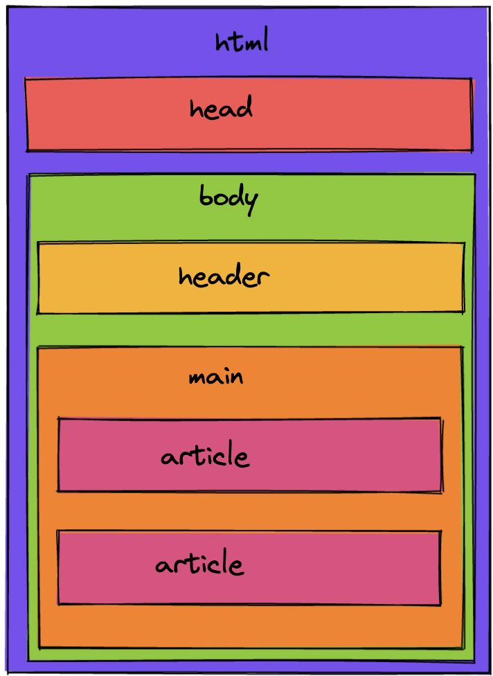

# HTML semántico

No se utilizan etiquetas o atributos semánticos en los mensajes de este ejemplo. Mejorémoslo cambiando las etiquetas y atributos a código HTML semántico, para que las computadoras puedan entender qué tipo de información se presenta. Mire la imagen, que muestra un ejemplo de una estructura HTML semántica.

Completa los siguientes cambios en el archivo index.html:

- Reemplaza una etiqueta existente con la etiqueta **<header role="banner">** para especificar el área de encabezado del sitio.
- Reemplaza una etiqueta existente con la etiqueta **<main role="main">** para especificar el contenido principal del sitio.
- Reemplaza las etiquetas existentes con la etiqueta **<article>** para agrupar la información relacionada con un solo mensaje.

Desafío adicional: lee este artículo sobre la etiqueta **<time>** y el atributo **datetime=**"". Usa esto para especificar la hora de cada mensaje.

Sugerencia: para completar este ejercicio, debes modificar las etiquetas HTML sin eliminar los atributos que ya están allí. Por ejemplo, si quisiera cambiar **

** a una etiqueta **<article>**, usaría **<article class="article"></article>**. El atributo de clase no debe eliminarse.