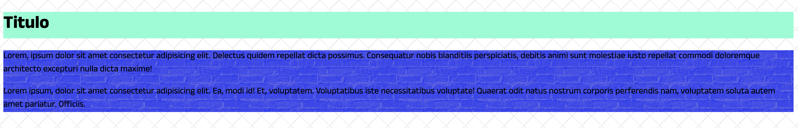

# Background

Dado el siguiente HTML, aplicar los distintos fondos y colores proporcionados para que se refleje todo de manera similar al resultado provisto.

**Resultado**
---

<div align="center"></div>

**Autoevaluación**
---

- Aplicar un color “aquamarine” de fondo al título.
- El contenedor de los párrafos tiene un color de fondo “blue”.
- Aplicar la siguiente imagen como fondo de todo el documento:

```
"https://www.transparenttextures.com/patterns/always-grey.png"
```

- El contenedor de los párrafos tiene como fondo la siguiente imagen.

```
"https://www.transparenttextures.com/patterns/brick-wall.png"
```

- La imagen del contenedor tiene que tener un tamaño del 10% respecto a su tamaño original.
- Asignarle la propiedad correspondiente al fondo del documento completo para que no se desplace al hacer scroll.