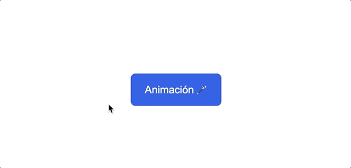

# Button hover

En este ejercicio tendremos que usar una transición que modifique la escala del botón cuando hacemos hover sobre él.

**Resultado**
---

**Autoevaluación**
---

- El botón tiene que aumentar su escala un 1.2.
- La transición dura 0.3 segundos.
- La transición va tanto en un sentido como en otro, disminuyendo su escala al dejar de hacer hover.