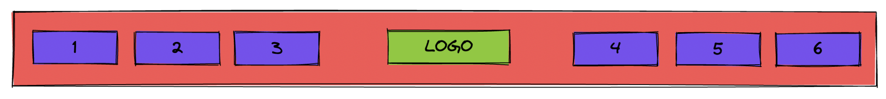

# Header Flex

Usa las reglas de flexbox para crear este estilo de encabezado de página web muy común. El beneficio de usar flex aquí es que todo debe ser flexible. Mira las dos capturas de pantalla a continuación para tener una idea de cómo debería escalar con su pantalla. Además de las reglas flexibles, también querrá agregar algunas reglas para el margen y el relleno. (Sugerencia: `uls` tiene un `margin/padding` predeterminado con el que tendrá que trabajar por defecto).

**Resultado**
---

**Autoevaluación**
---

- Hay espacio entre todos los elementos y el borde del encabezado (la cantidad específica de px no importa aquí).
- El logotipo está centrado vertical y horizontalmente.
- Los elementos de la lista son horizontales y están centrados verticalmente dentro del encabezado.
- Los enlaces a la izquierda y los enlaces a la derecha se empujan completamente hacia la izquierda y hacia la derecha, y permanecen en el borde del encabezado cuando se cambia el tamaño de la página.
- La solución no utiliza floats, inline-blocks o positions absoluts.