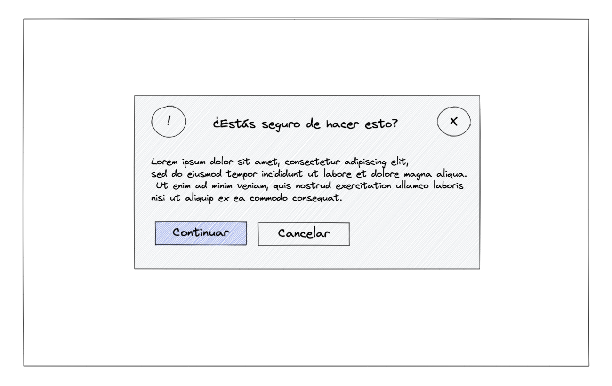

# Modal

Con lo aprendido hasta ahora tendremos que completar los estilos de un modal emergente, elemento muy usado en las aplicaciones web actuales.

**Resultado**
---

**Autoevaluación**
---

- El botón de continuar tiene que estar alineado a la izquierda.
- Todo el modal tiene padding.
- Al igual que el botón continuar, el header y el texto tienen que estar alineados en la misma linea.
- El icono de alerta, el header y el cierre tienen que estar alineados.
- Todos los elementos globales tienen el mismo gap.