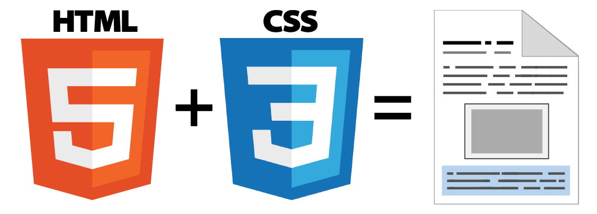

# Bienvenidos CSS3 by Rock{theCode} 👨🏽‍💻

Si te gusta el mundo del **diseño web** o tienes curiosidad por empezar en este sector, probablemente ya habrás escuchado el término **CSS**. Se trata de una tecnología utilizada para dotar de **cualidades visuales y estéticas** a una página web. Si nunca has tocado esta materia, comprobarás que se trata de una forma analítica, lógica y prácticamente matemática de crear páginas web, pero gracias a ella podemos simplificar la creación de páginas y conseguir exactamente lo que buscamos.

La **curva de aprendizaje** de CSS suele ser sencilla (*es fácil aprender a hacer cosas, aunque complicado dominar*), aunque también es cierto que puede resultar complejo adaptarse si nunca has programado (*o eres totalmente ajeno a estas temáticas*), pero a medida que cometes errores y vas practicando, tu capacidad para escribir código CSS mejora progresivamente, permitiéndonos avanzar a un ritmo cada vez más veloz.

**¿Qué es CSS?**
---

Antes de comenzar, debes tener claro un concepto clave: una página web es realmente **un documento de texto**. En dicho documento se escribe **código HTML**, con el que se que crea el contenido de una web. Por otro lado, existe el **código CSS**, que unido al código HTML permite darle forma, color, posición (*y otras características visuales*) a una página.

En resumen, se trata de un idioma como podría ser el inglés o el alemán, que los navegadores web como **Chrome** o **Firefox** conocen y pueden entender. Nuestro objetivo como diseñadores y programadores web es precisamente ese: **aprender el idioma**.

Las siglas **CSS** (*Cascading Style Sheets*) significan «Hojas de estilo en cascada» y parten de un concepto simple pero muy potente: aplicar **estilos** (colores, formas, márgenes, etc...) a uno o varios documentos (*generalmente documentos HTML, páginas webs*) de forma masiva.

Se le denomina estilos **en cascada** porque se aplican de arriba a abajo (*siguiendo un patrón denominado **herencia** que trataremos más adelante*) y en el caso de existir ambigüedad, se siguen una serie de normas para resolverla.

La idea de CSS es la de utilizar el concepto de **separación de presentación y contenido**, intentando que los documentos HTML incluyan sólo información y datos, relativos al significado de la información a transmitir (*el contenido*), y todos los aspectos relacionados con el estilo (diseño, colores, formas, etc...) se encuentren en un documento CSS independiente (*la presentación*):

De esta forma, se puede unificar todo lo relativo al diseño visual en **un solo documento CSS**, y con ello, varias ventajas:

- Si necesitamos hacer modificaciones **visuales** lo hacemos en **un sólo lugar**. No necesitamos editar todo el HTML en cuestión por separado.
- Se reduce la **duplicación de estilos** en diferentes lugares, por lo que es más fácil de organizar y hacer cambios. Además, al final la información a transmitir es considerablemente menor (*las páginas se descargan más rápido*).
- Es más fácil crear **versiones diferentes** de presentación para otros tipos de dispositivos: tablets, smartphones o dispositivos móviles, etc...