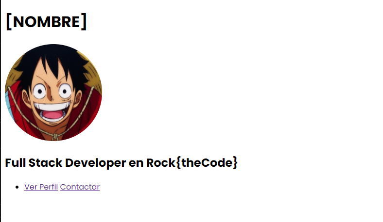
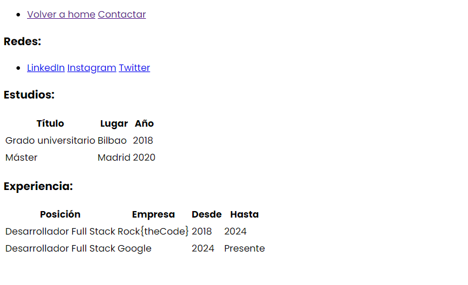
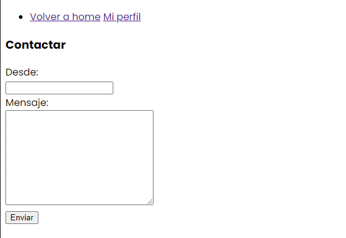

# Ejercicio 12 - Páginas múltiples con HTML

Vamos a trabajar sobre lo que hemos creado en el ejercicio anterior, pero ahora vamos a organizar mucho mejor nuestro código para hacerlo más mantenible.

## Pasos a seguir:

- Crea un `index.html`, un `profile.html` y un `contact.html`.
- En cada uno de ellos, pega la misma cabecera que hiciste en el ejercicio anterior. Aunque cambia el título a lo que prefieras para cada página, ya que vamos a crear un set de tres páginas. Te recomendamos:
  - Para `index.html` => Como `title` usar `Mi perfil en Rock{theCode}`.
  - Para `profile.html` => Como `title` usar `Mi experiencia y estudios`.
  - Para `contact.html` => Como `title` usar `Contactar`.
- Recuerda cargar las fuentes de Google Fonts como ya hicimos y añádelas al `body` con los estilos.
- Ahora en `index.html`, añade la misma parte que hicimos en el ejercicio 01, es decir, tu nombre, imagen y título que añadimos.
- Crea debajo un `ul` que contenga dos elementos `li` con links `a` (sin target blank), que apunten a cada uno de los otros archivos HTML que hemos creado, siguiendo el siguiente ejemplo:

```html
<li><a href="./contact.html">Contacto</a></li>
```

Tu página `index.html` debería quedar así:



**Comprueba que si haces click en cada link, navegas al elemento HTML de la misma carpeta en tu navegador**

- Ahora vamos a añadir información a `profile.html`. Vamos a copiar dentro de profile todas las `section` que creamos excepto la del formulario.
- Añade sobre estos bloques otro `ul` con dos elementos `li` con links `a` que apunten a cada HTML, pero en este caso habrá dos opciones distintas: `Volver a home`, y `Contactar`.

Tu página `profile.html` debería quedar así:



**Comprueba que si haces click en cada link, navegas al elemento HTML de la misma carpeta en tu navegador**

- Y para terminar, vamosa replicar lo que hemos hecho también con el formulario de contacto. Ahora pega en `contact.html` la `section` de formulario completa que hiciste en el ejercicio 01.
- Añade sobre este bloque otro `ul` con dos elementos `li` con links `a` que apunten a cada HTML, pero en este caso habrá dos opciones distintas: `Volver a home`, y `Mi perfil`.

Tu página `contact.html` debería quedar así:



**Comprueba que si haces click en cada link, navegas al elemento HTML de la misma carpeta en tu navegador**

## Con esto, habrás creado una página con soporte para múltiples URLs! 🧙‍♂️
