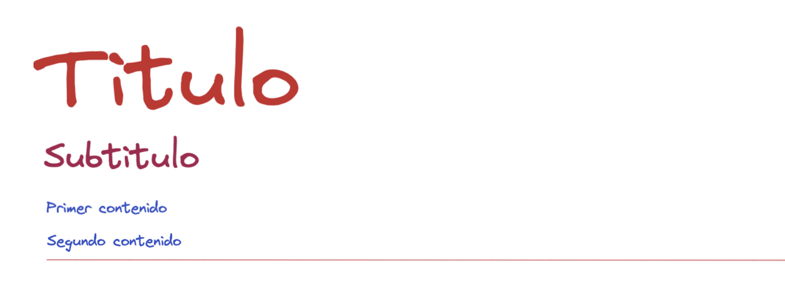

# Colors

Dado el siguiente código de HTML, asignar los colores correspondientes según el ejemplo visual a los diferentes elementos.

**Resultado**
---

**Autoevaluación**
---

- Los colores a aplicar son los siguientes: #c92a2a, #a61e4d y #364fc7.
- El segundo contenido tiene un borde inferior del mismo color que el título.
- Tanto el título como el subtitulo tiene que tener los colores asignados a través de los elementos, y el resto de contenido a través de las clases asignadas.
- Asignar el color del primer y segundo contenido en la misma línea de CSS.
- Asignar el subrayado con borde en otra diferente.
- El borde inferior del segundo contenido en sólido y tiene 1px de grosor. Asignare todas las propiedades del borde en la misma línea.