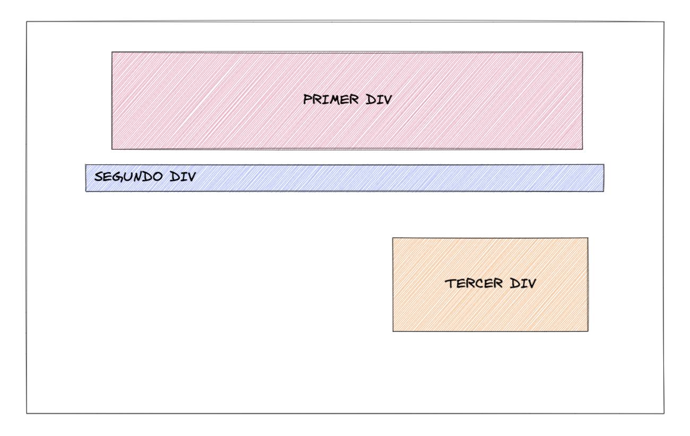

# Margin & Padding

Edita el fichero style.css en las líneas indicadas para conseguir el resultado propuesta en la siguiente imagen.

**Resultado**
---

**Autoevaluación**
---

- El primer div y el tercer div tienen 32 píxeles entre el texto y el borde.
- El primer div tiene 12 pixeles entre si mismo y otro elemento.
- Hay un hueco de 48 pixeles entre el segundo div y el tercer div.
- El tercer div está alineado a la derecha y utiliza solamente margin para ello.