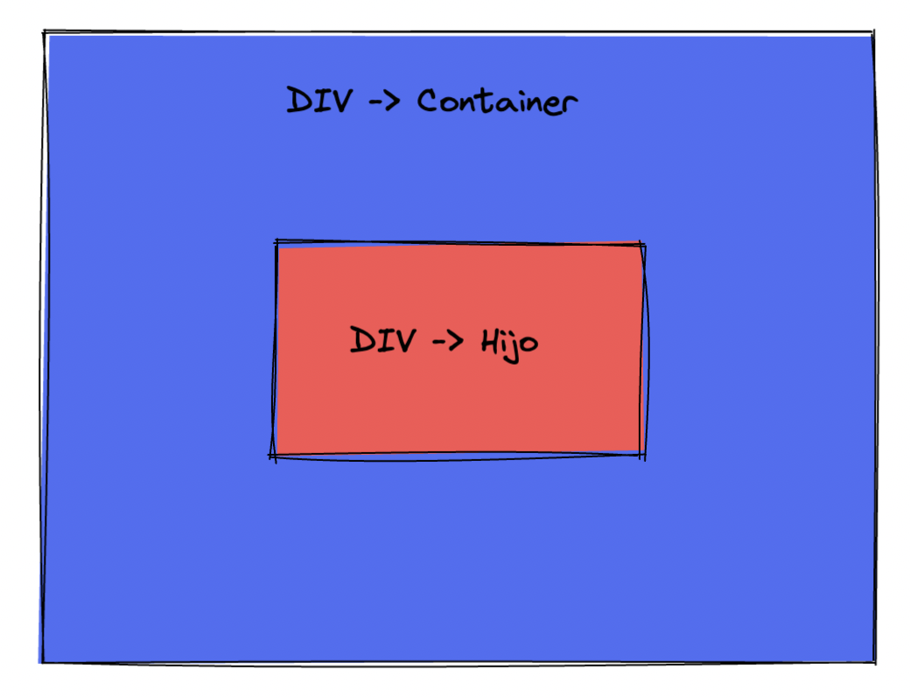

# Centrar 
 con Flex

Este es un ejercicio sencillo de Flex, pero es algo que tendrás que hacer varias veces. por ello vamos a atacarlo cuanto antes.

Todo lo que necesitas hacer es centrar el div rojo dentro del contenedor padre azul.

**Resultado**
---

**Autoevaluación**
---

¿Está centrado el div rojo?
¿Solo usaste flexbox para centrarlo?