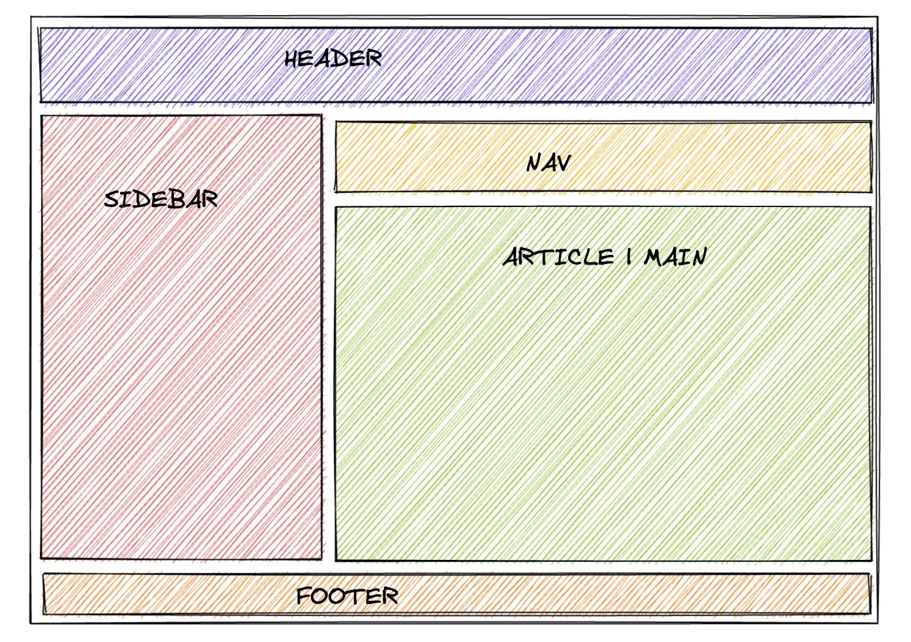

# Grid Layout

Ahora es el momento de practicar las herramientas de grid que hemos aprendido y crear un diseño que pueda parecerle familiar. Vamos a hacer un Diseño del Santo Grial como los que creamos usando Flexbox. La diferencia aquí es que no confiaremos en Flexbox. Solo usaremos Grid. ¡Podrás ver los beneficios de Grid por ti mismo!

**Pistas**
---

- Solo necesitas agregar contenido a los selectores de CSS.
- Consulta la sesión tantas veces como sea necesario.
- Usa tamaños de pista fijos (por ejemplo, píxeles) para sus columnas y filas.

**Resultado**
---

**Autoevaluación**
---

- El gap es de 15px
- La grilla tiene dos columnas.
- La cuadrícula tiene cuatro filas.
- La segunda columna es tres veces más grande que la primera.
- La tercera fila es cinco veces más grande que las demás.
- Los elementos de encabezado y pie de página abarcan ambas columnas.
- El elemento de la barra lateral solo se extiende a lo largo de la primera columna.
- Los elementos de navegación y artículo se extienden a lo largo de la segunda columna.