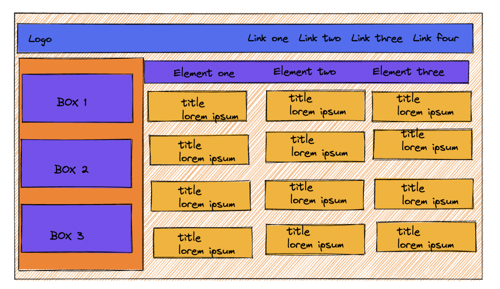
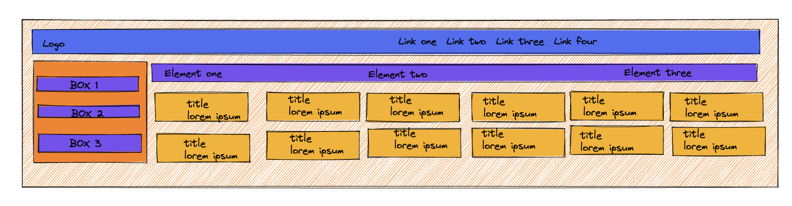

# Grid Layout Responsive

Ahora que has hecho que tu diseño ****Holy Grail Layout**** sea ********responsive, vamos a divertirnos haciéndolo un poco más complicado y agregando algunas características. Es posible que encuentre que esto es un poco más complicado de lo esperado. Incluso podrías tener la tentación de usar Flexbox. Pero por el bien de esta tarea de práctica, intenta ver si puedes descubrir cómo recrear esta maqueta completa usando solo Grid. ¡Siéntete libre de agregar tu propio contenido ficticio o estilos también!

**Pistas**
---

- Para este ejercicio, deberás agregar algunos bloques de declaración CSS al archivo style.css. Mira a través del HTML para ver qué selectores y combinadores puede usar.
- Toma el diseño de una sección a la vez
- No necesitas agregar ni cambiar nada en el HTML, pero será útil revisar las relaciones entre elementos principales y secundarios.
- Al igual que con Flexbox, puedes centrar fácilmente un elemento convirtiéndolo en una cuadrícula.
- No te preocupes por el estiramiento del elemento de imagen del marcador de posición al cambiar el tamaño de la ventana del navegador.

**Resultado**
---

Si has entendido bien el uso de Grid e investigado por tu cuenta puedes hacer que las cards [title + lorem ipsum] se ajusten a tu pantalla.

**Autoevaluación**
---

- El elemento contenedor tiene dos columnas.
- La segunda columna del contenedor es 4 veces más grande que la primera columna.
- El elemento contenedor tiene un espacio de 4px.
- El elemento de encabezado tiene dos columnas.
- El ul dentro del elemento del menú contiene otra cuadrícula.
- El ul dentro del elemento de navegación contiene otra cuadrícula.
- El elemento de la barra lateral tiene un espacio de 50px
Los elementos de texto en la barra lateral están centrados con cuadrícula.
- El elemento del artículo debe establecer columnas de cuadrícula usando repetir junto con las propiedades de ajuste automático y minmax.
- Las columnas del artículo deben tener un valor mínimo de 250px y un máximo de 1fr unidad.
- El elemento del artículo tiene un espacio de 15px.
- Los elementos de la tarjeta dentro del contenedor del artículo tienen una altura de 200px.
- El encabezado y el pie de página abarcan ambas columnas.
La barra lateral solo se extiende a lo largo de la primera columna.
- Los elementos de navegación y artículo solo se extienden a lo largo de la segunda columna.