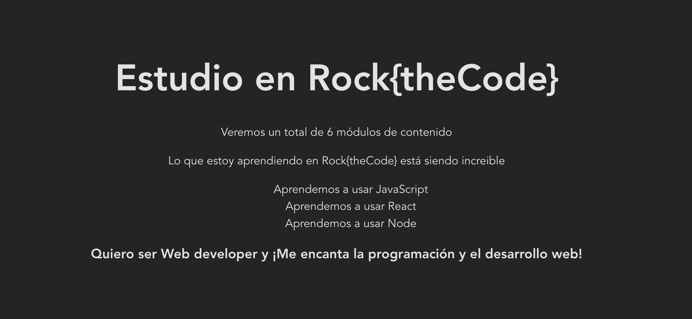

# 01 - Interpolación y JSX

## Preparación del ejercicio

**¡Esto lo vas a repetir en cada ejercicio, apunta los pasos y presta atención!**

Hemos visto en el contenido en video del máster que `React` se trabaja utilizando `JSX`. Aplicando lo que hemos aprendido y practicado en los ejemplos, completa el siguiente ejercicio siguiendo los pasos:

1. Navega con tu terminal hasta esta carpeta con el comando `cd Modulo-2/1-react/2-ejercicios/general`.
2. Crea ahora un proyecto de React aquí dentro, en la carpeta `general`, utilizando Vite con el comando `npm create vite@latest`. Llama al proyecto `01-jsx-interpolacion`, practicamente como este archivo pero sin la extensión `.md`.
3. Entra en la carpeta de tu proyecto con `cd 01-jsx-interpolacion` e instala las dependencias para que tu proyecto funcione con `npm install`.
4. Ahora corre tu proyecto en modo desarrollo en la terminal con `npm run dev`. Deberías ver una URL en la terminal parecida a `http://localhost:5173`, pégala en Chrome y ya tendrás tu proyecto de React corriendo en tu navegador 🎸
5. Antes de comenzar a trabajar con el ejercicio, recuerda ir al archivo `App.jsx` y "limpiar el componente", es decir, haz que el `return` del componente se simplifique al máximo y devuelva esto: `<div><h1>Título</h1></div>.

## Enunciado

En este ejercicio vas a aprender a interpolar valores en un componente de React, y para ello vas a utilizar el componente `App` del archivo `src/App.jsx` de tu proyecto.

Este componente es la base sobre la que vamos a construir toda nuestra aplicación web, y lo ideal es que componeticemos toda la aplicación y estructuremos todo por piezas y componentes como si fueran piezas de Lego. Aunque para aprender vamos a ir poco a poco y comenzaremos trabajando sobre este componente `App` directamente.

En tu archivo `App.jsx` añade el siguiente código en el que declaramos varias variables y funciones (recuerda añadirlo antes de tu componente `App` y debajo de los `import` para que sea un código válido):

```js
const school = 'Rock{theCode}';
const chapters = 6;
const isAwesome = true;
const technologies = ['JavaScript', 'React', 'Node'];
const profile = {
  job: 'Web developer',
  description:
    '¡Me encanta la programación y el desarrollo web!',
};
```

Ahora que tienes este contenido, vamos a interpolarlo dentro de nuestro `JSX`, es decir, en el `return ()` de nuestro componente `App` devolvemos un pseudo HTML en el que añadiremos estas variables siguiendo las instrucciones que te dejamos a continuación:

Tendrás que interpolar variables cada vez que aparezca esto `__nombreVariable__` con el nombre de la variable. Por ejemplo, para la variable `school` verás `__school__` y tu tendrás que hacer la interpolación correcta usando **React**.

1. Crea un `h1` que contenga la frase => Estudio en `__school__`.
2. Crea un `p` que contenga la frase => Veremos un total de `__chapters__` módulos de contenido.
3. Crea un `p` que contenga un **ternario** que devuelva un mensaje "increible" si la variable `isAwesome` es `true` y otro mensaje "top" si es `false`. Interpola ese ternario dentro de la frase => Lo que estoy aprendiendo en `__school__` está siendo `__AQUÍ EL TERNARIO USANDO isAwesome__`.
4. Crea un `ul` y dentro de este elemento, interpola un array de valores mapeados a JSX tal y como hemos visto. Para ello usa la variable `technologies`, aplica `.map` para devolver JSX para cada elemento, y devuelve la siguiente frase para **cada una de las tecnologías**=> Aprendemos a usar `__technology__`.
5. Por último, crea un `h3` donde interpolarás propiedades del objeto `profile` formando la siguiente frase => Quiero ser `__profile.job__` y `__profile.description__`.

Si has interpolado todas las variables correctamente, deberías ver una web que muestre algo parecido a esto:


