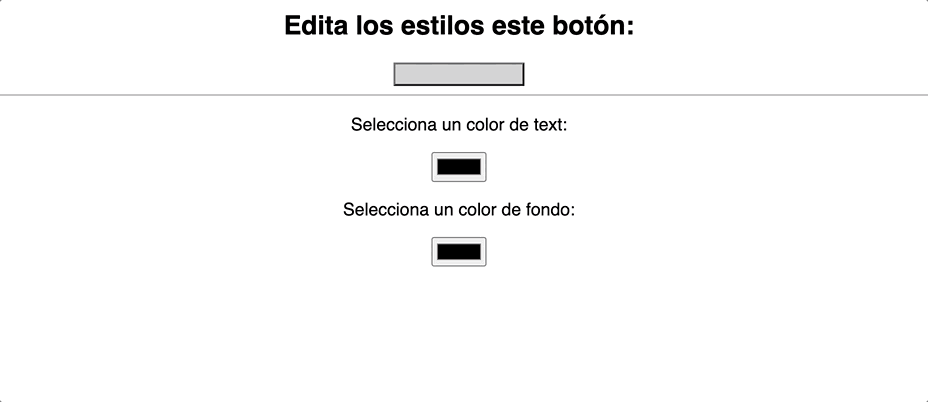

# 10 - Efectos - III

## Preparación del ejercicio

¡Igual que en el ejercicio `01-jsx-interpolacion.md`! Prepara tu proyecto de Vite con React y sigue el enunciado 🦄

## Enunciado

En este ejercicio vas a aprender a utilizar estilos `inline` usando CSS-in-JS, es decir, vas a crear un objeto de JavaScript que si es pasado como prop a un componente o elemento HTML, cambiará sus estilos como si de CSS se tratase. Existen librerías que permiten implementar este tipo de patrones de forma avanzada, segura y escalable como `emotion` o `styled-components`, las cuales verás en los videos del contenido del máster dentro de poco 🎨.

Aquí tienes un ejemplo de los estilos inline en React:

```jsx
<button
  style={{
    color: 'white',
    backgroundColor: 'blue',
  }}
>
  Hola RockTheCode
</button>
```

Fíjate en que las propiedades se escriben en `camelCase` en lugar de `kebab-case` como hacíamos con CSS.

Aquí los pasos que debes seguir para completar este ejercicio con el uso de `useState` y `useEffect`:

1. Crea un elemento `button` con el texto `"Estilos dinámicos"` en tu componente `App`. Vamos a trabajar aquí durante todo el ejercicio para simplificar las cosas. Puedes acompañarlo de un `h2` que contenga el texto `Editando estilos de forma dinámica` antes del botón.
2. Ahora crea dos estados usando `useState`, uno llamado `style` con el valor inicial objeto vacío `{}` y otro llamado `backgroundColor` con el valor inicial `'white'`.
3. Añade en tu JSX un `input` de tipo `color` acompañado de un `label` con el texto `Selecciona un color de fondo:`. Este `input` tendrá un prop `onChange` que se lanzará cada vez que el input cambie. Recuerda lo que hemos visto en los videos del contenido sobre los eventos de los inputs, y obtén el valor al que cambia el input con `event.target.value`. Usa ese valor para cambiar el estado `backgroundColor` a la selección del usuario.
4. Ahora crea un `useEffect` que escuche a los cambios del estado `backgroundColor` y en la función principal de este `useEffect`, crea un objeto `newStyles` que contendrá la propiedad `backgroundColor` con el valor de tu estado con el mismo nombre. Ahora usa ese objeto `newStyles` al estado `style`.
5. Por último, pasa un prop `style` al botón que creamos al principio con el valor del estado `style` y observa como cambia su color de fondo de forma dinámica cuando cambias el `input`! 🧙‍♂️

## Bonus

Repite el mismo proceso para personalizar más el elemento `button`, aquí te dejamos varias propiedades que pueden ayudarte a dominar lo que hemos visto hasta ahora:

- Crea un estado `color` donde almacenar el color de texto para usar en el botón. Combínalo con un nuevo `input type="color"` y el estado `style` a través del mismo `useEffect` de antes.
- Crea un estado `fontSize` donde almacenar el tamaño del texto para el botón. Combínalo con un nuevo `input type="number"` y sigue el proceso anterior. En este caso cambiarás un valor numérico, pero recuerda que a los estilos de CSS-in-JS tendrás que pasarle los píxeles, por lo que la propiedad `fontSize` de los estilos que crees en el `useEffect` tendrán que ser `${fontSize}px` para propagar el tamaño como píxeles para el botón.
- Crea un estado `borderRadius` donde almacenar el radio del borde del botón, funcionará a través de un `input type="number"` y repite el proceso anterior.

## Resultado esperado

Este ejercicio te llevará esfuerzo y mucho debugging, pero si lo completas conseguirás algo similar a lo que te enseñamos en el siguiente GIF 🔥:


