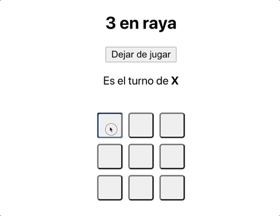
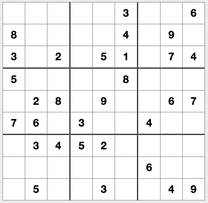

**Introducción**
---

¡Lo has hecho muy bien para haber llegado hasta aquí! Ahora que estamos entrando a la recta final  vamos a avanzar en módulo de `React` haciendo algo grande.

Este proyecto no será un proyecto al uso en el que nos centraremos en una sola temática, es tu turno de elegir y aprender a valorar tu alcance tras haber aprendido tantísimo en estos meses 🎉

**Proyecto propuesto**
---

Este proyecto puede llevarse al alcance que cada cual estime posible dentro de lo que hemos aprendido y sabemos poner el práctica. Vamos a crear un `**Hub de juegos`** en el que tendremos tres actividades sobre las que elegir.

Tic-tac-toe o tres en raya (`'/tictactoe'`)
---

Este juego constará de una pantalla en la que tendremos los siguientes elementos:

Un botón para comenzar partida, que dependa de una propiedad del estado `isStarted`, esta será un `boolean`. Si el juego ha comenzado, el botón debe poder acabar la partida en cualquier momento y resetear la información.

Un mensaje que indique el jugador actual. Como en este juego usaremos el símbolo `X` para un jugador y el `O` para otro (¡puedes cambiarlos a tu gusto!), informaremos de esto en el mensaje.  Por ejemplo: `Es el turno de X` o `Es el turno de O`.

Un tablero que consistirá en un array de arrays de 3x3 en el que tendremos cada `casilla` o `celda` con un valor inicial `null`, aquí un ejemplo:

```jsx
[
  [null, null, null],
  [null, null, null],
  [null, null, null],
]
```

Cada celda podrá ser un botón que, al ser clickado, añada el símbolo del jugador al array:

```jsx
[
  ['X', null, null],
  ['O', 'X', null],
  [null, null, 'O'],
]
```

Usando un sistema de turnos a través de otro elemento del estado, validaremos si el juego ha terminado cuando un jugador haya conseguido que su símbolo correspondiente esté repetido en las siguientes condiciones:

```jsx
1 - Todas las celdas de una fila son del mismo símbolo
2 - Todas las celdas de una columna son del mismo símbolo
3 - Todas las celdas de una diagonal son del mismo símbolo
```

Recomendamos que compruebe cada caso por separado siempre que un jugar añada un nuevo símbolo al tablero (`useEffect` podría ser buena idea para lanzar el validador).

Cuando el tablero se llene sin un jugador ganador, tendremos un empate y el juego terminará y todo volverá al estado original.

Aquí te dejamos un GIF de ejemplo (haz tu tres en raya más bonito 🙏):

<div align="center"></div>

**Juego del ahorcado (`'/hangman'`)**
---

Busca una lista de palabras o crea una propia con tantas palabras como quieras en el idioma que mejor te parezca.

Crea un botón de empezar partida que al ser clickado recoja una palabra aleatoría del array de palabras y genere la pista inicial:

```jsx
Palabra: 'Coche'

Pista: _ _ _ _ _
```

Crea ahora un sistema de input de letras por parte de los usuarios, ya sea un conjunto de botones con el abecedario, un input, que cada letra de la pista sea un input inicialmente...

Cada vez que un usuario introduzca una letra, comprobaremos si está en nuestra palabra. De ser así, la mostraremos `donde corresponde,` en caso contrario, mostraremos la letra en la pantalla bajo una lista de `letras erróneas` utilizadas y no permitiremos que nuestro usuario la introduzca de nuevo (puedes almacenarlas en un array de letras utilizadas para comprobar 😆).

Daremos un número de intentos máximos al usuario, por lo que si el usuario falla el máximo de veces permitidas le informaremos de que la partida se ha terminado y tendrá que comenzar una nueva partida.

Si acierda todas las letras, ¡habrá ganado!

**Sudoku (`/sudoku)`)**
---

¡Wow! Crear y validar un sudoku es algo bastante complicado que lleva tiempo, pero vamos a echarte una mano en la parte que no está tan relacionada con `React`:

No te preocupes por crear un algoritmo para comprobar la solución, es algo muy tedioso que no está relacionado directamente con React. Usa la librería `sudoku` que podrás instalar mediante `npm i sudoku`.

Esta librería genera un array de un solo nivel con `81` celdas, es decir, `9x9` elementos que podremos renderizar sin problemas 🎉 Algunos números vienen ya en el array y tendremos que sustituir los valores `null` por nuevos números adecuados.

Aquí te dejamos un ejemplo con estado local sobre como generar nuestro propio sudoku 

```jsx
const [sudokuBoard, setSudokuBoard] = useState(null);

  useEffect(() => {
    const newBoard = sudoku.makepuzzle();
    setSudokuBoard(newBoard);
  }, []);
```

Cuando nuestros usuarios completen el sudoku, invocaremos la siguiente función que generará un nuevo array con nuestro sudoku solucionado, donde podremos validar si todos los elementos de éste son iguales:

```jsx
const solved = sudoku.solvepuzzle(sudokuBoard);

// Comprobamos si solved y sudokuBoard tienen las mismas celdas
```

Puedes pintar ahora tu tablero usando el array generado, de forma que tengamos algo parecido a lo siguiente:

<div align="center"></div>

Cada celda creada puede ser un pequeño input que altere su posición dentro del array cuando escribamos dentro.

En el momento en que el usuario haya completado la última celda disponible, permitiremos que esté disponible el botón para validar su sudoku contra la solución.

Si la solución no es correcta, le daremos a nuestros usuarios las siguientes posibilidades:

```jsx
- Ver la solución y acabar la partida.
- Seguir intentándolo y comprobar más tarde. 
```

Añadir un botón para empezar una nueva partida siempre que queramos, pisando los datos anteriores de nuestro estado.

**Para terminar...**
---

Recuerda que tu mism@ de puedes poner tus propios límites, completa tanto como puedas siempre y cuando mantengas una buena calidad de código y comprendas bien todo lo que estás haciendo 🦄

Recuerda que el objetivo es conseguir una `Home` para nuestro `Hub Games` que tendrá cada uno de los juegos propuestos disponibles.

Si no puedes completar alguno de los juegos, haz que el `Link` al juego no sea clickable o no lleve a ningún sitio y añade un mensaje `En construcción...🚧` o algo similar.

¡No olvides hacer una buena maquetación y crear unos estilos propios que ensalcen el contenido de nuestro proyecto!

**Tareas Bonus** 
---

Si has terminado los juegos de nuestro `Game Hub` y buscas más retos, recuerda que puedes usar   `Localstorage`  con la finalidad de simular información real para uso demostrativo para crear crear un pequeño sistema "simulado" de `autenticación y rutas protegidas`.

También podrías crear `marcadores` de cada uno de los juegos e ir mostrando todos ellos gracias al contexto.

Puedes añadir tantas funcionalidades nuevas y alternativas como quieras, siempre que hayas conseguido crear todos los juegos descritos previamente. Todo esto te permitirá tener un portfolio de calidad y muy llamativo para tu futuro profesional.