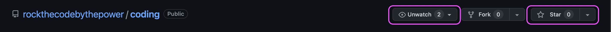

# Bienvenidos a Rock{theCode}! 👨🏽‍💻

En este repositorio tendréis el código que el equipo de profesores de **Rock{theCode}** irán trabajando en las **Master Classes**.

Cada track de Master Classes de un mes y medio está agrupado en una carpeta, con el contenido de cada módulo dentro:

```bash
|-> 📁 2022-classes-legacy-sin-track # Contenido que hicimos antes del lanzamiento de los tracks
|-> 📁 2023-track-01
|-> 📁 2023-track-02
|-> 📁 ...
```

Según se vayan haciendo proyectos, ejemplos, contenido... las carpetas de cada módulo en cada track irán creciendo de forma orgánica. Así tendrás las referencias necesarias para **completar los proyectos que debes presentar** para certificarte como Full Stack Developer en Rock{theCode}! 🦄

Por ello en cada carpeta de un track, tendremos las carpetas de cada módulo con cada sesión ordenada. En estas se encontrará el proyecto o código que se haya trabajo en dicha sesión(es). Ten en cuenta que si estás en la **sesion 3 del módulo Frontend Developer del track 02 de 2023**, el código estará en el path: `2023-track-02/02-frontend-developer/sesion-03/...`

```bash
|-> 📁 2023-track-01
	|-> 📁 01-javascript-developer
		|-> 📁 sesion-01
			|-> El código estará aquí dentro 👩‍💻👨‍💻
		|-> 📁 sesion-02
		|-> 📁 ...
	|-> 📁 02-frontend-developer
		|-> 📁 sesion-01
			|-> El código estará aquí dentro 👩‍💻👨‍💻
		|-> 📁 sesion-02
		|-> 📁 sesion-03
		|-> 📁 ...
```

> Por ello os recomendamos que sigáis los cambios del repositorio y le deis a la estrellita 🌟

<div></div>

Además de esto podéis clonar o forkear el repositorio e ir bajando las actualizaciones del mismo, tal y como os explicamos en el video de entornos. Si tenéis muchos problemas con esto, preguntad por nuestra comunidad de Discord 👾:

```bash
# Actualizo mis cambios en la rama main de mi fork...
# Cambio de rama a main:
git checkout main

# Me bajo los últimos cambios en la rama:
git pull origin main

# Cambio de rama a mi rama de trabajo (por ejemplo, learning):
git checkout learning

# Me traigo los cambios de la rama main:
git merge main
```

**¡Disfrutad de la experiencia! ⇒ Happy Coding 🖖🏽 || Happy Rocker 💕**
